<h3>Hi there :wave:</h3>

My name is Stas.

- [DDEV](https://github.com/ddev/ddev) Maintainer (Golang Developer) since Autumn 2023
- Join me in the 
- PHP Developer since 2018
- Experienced in the entire project development life cycle, including coding, software testing, and debugging

  
:zap: Recent GitHub Activity

<!--RECENT_ACTIVITY:start-->
1. 💪 Opened PR [#8332](undefined) in [ddev/ddev](https://github.com/ddev/ddev) 
2. 💬 Commented on [#609](https://github.com/ddev/ddev.com/pull/609#discussion_r3102426094) in [ddev/ddev.com](https://github.com/ddev/ddev.com) 
3. 💬 Commented on [#609](https://github.com/ddev/ddev.com/pull/609#discussion_r3102418471) in [ddev/ddev.com](https://github.com/ddev/ddev.com) 
4. 💬 Commented on [#609](https://github.com/ddev/ddev.com/pull/609#discussion_r3102397120) in [ddev/ddev.com](https://github.com/ddev/ddev.com) 
5. 💬 Commented on [#609](https://github.com/ddev/ddev.com/pull/609#discussion_r3102383085) in [ddev/ddev.com](https://github.com/ddev/ddev.com) 
6. 💬 Commented on [#609](https://github.com/ddev/ddev.com/pull/609#discussion_r3102374335) in [ddev/ddev.com](https://github.com/ddev/ddev.com) 
7. 💬 Commented on [#609](https://github.com/ddev/ddev.com/pull/609#discussion_r3102364794) in [ddev/ddev.com](https://github.com/ddev/ddev.com) 
8. 💬 Commented on [#609](https://github.com/ddev/ddev.com/pull/609#discussion_r3102358411) in [ddev/ddev.com](https://github.com/ddev/ddev.com) 
9. 👍 Approved [#591](https://github.com/ddev/ddev.com/pull/591#pullrequestreview-4131056168) in [ddev/ddev.com](https://github.com/ddev/ddev.com) 
10. 👍 Approved [#8226](https://github.com/ddev/ddev/pull/8226#pullrequestreview-4131008660) in [ddev/ddev](https://github.com/ddev/ddev) 
11. 👍 Approved [#8331](https://github.com/ddev/ddev/pull/8331#pullrequestreview-4130987357) in [ddev/ddev](https://github.com/ddev/ddev) 
12. 💬 Commented on [#8298](https://github.com/ddev/ddev/issues/8298#issuecomment-4269475008) in [ddev/ddev](https://github.com/ddev/ddev) 
13. 👍 Approved [#31](https://github.com/ddev/sponsorship-data/pull/31#pullrequestreview-4130099827) in [ddev/sponsorship-data](https://github.com/ddev/sponsorship-data) 
14. 💬 Commented on [#8328](https://github.com/ddev/ddev/pull/8328#issuecomment-4269112004) in [ddev/ddev](https://github.com/ddev/ddev) 
15. 👍 Approved [#8313](https://github.com/ddev/ddev/pull/8313#pullrequestreview-4129576612) in [ddev/ddev](https://github.com/ddev/ddev) 
16. 💬 Commented on [#8328](https://github.com/ddev/ddev/pull/8328#issuecomment-4268560135) in [ddev/ddev](https://github.com/ddev/ddev) 
17. 👍 Approved [#8325](https://github.com/ddev/ddev/pull/8325#pullrequestreview-4129193163) in [ddev/ddev](https://github.com/ddev/ddev) 
18. 👍 Approved [#8259](https://github.com/ddev/ddev/pull/8259#pullrequestreview-4128911196) in [ddev/ddev](https://github.com/ddev/ddev) 
19. 💬 Commented on [#1](https://github.com/trebormc/ddev-claude-code/issues/1#issuecomment-4268076694) in [trebormc/ddev-claude-code](https://github.com/trebormc/ddev-claude-code) 
20. 💪 Opened PR [#8329](undefined) in [ddev/ddev](https://github.com/ddev/ddev) 
<!--RECENT_ACTIVITY:end-->

  
:zap: GitHub Stats

  <picture>
    <source
      srcset="./profile/stats-dark.svg"
      media="(prefers-color-scheme: dark)"
    />
    <source
      srcset="./profile/stats-light.svg"
      media="(prefers-color-scheme: light), (prefers-color-scheme: no-preference)"
    />
    
  </picture>

