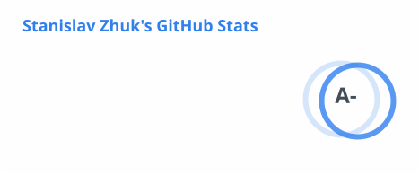

<h3>Hi there :wave:</h3>

My name is Stas.

- [DDEV](https://github.com/ddev/ddev) Maintainer (Golang Developer) since Autumn 2023
- Join me in the 
- PHP Developer since 2018
- Experienced in the entire project development life cycle, including coding, software testing, and debugging

  
:zap: Recent GitHub Activity

<!--RECENT_ACTIVITY:start-->
1. 💬 Commented on [#8832](https://github.com/ddev/ddev/issues/8832#issuecomment-5958845483) in [ddev/ddev](https://github.com/ddev/ddev) 
2. 👍 Approved [#8820](https://github.com/ddev/ddev/pull/8820#pullrequestreview-5395355900) in [ddev/ddev](https://github.com/ddev/ddev) 
3. 👍 Approved [#8896](https://github.com/ddev/ddev/pull/8896#pullrequestreview-5395260058) in [ddev/ddev](https://github.com/ddev/ddev) 
4. 👍 Approved [#8897](https://github.com/ddev/ddev/pull/8897#pullrequestreview-5394779984) in [ddev/ddev](https://github.com/ddev/ddev) 
5. 💬 Commented on [#8773](https://github.com/ddev/ddev/issues/8773#issuecomment-5956844399) in [ddev/ddev](https://github.com/ddev/ddev) 
6. 💪 Opened PR [#71](undefined) in [ddev/github-action-add-on-test](https://github.com/ddev/github-action-add-on-test) 
7. 👍 Approved [#8893](https://github.com/ddev/ddev/pull/8893#pullrequestreview-5394160719) in [ddev/ddev](https://github.com/ddev/ddev) 
8. 💬 Commented on [#8894](https://github.com/ddev/ddev/pull/8894#discussion_r4167561239) in [ddev/ddev](https://github.com/ddev/ddev) 
9. 💬 Commented on [#8894](https://github.com/ddev/ddev/pull/8894#discussion_r4167530870) in [ddev/ddev](https://github.com/ddev/ddev) 
10. 💬 Commented on [#8894](https://github.com/ddev/ddev/pull/8894#discussion_r4167518188) in [ddev/ddev](https://github.com/ddev/ddev) 
11. 💬 Commented on [#8894](https://github.com/ddev/ddev/pull/8894#discussion_r4167513869) in [ddev/ddev](https://github.com/ddev/ddev) 
12. 💬 Commented on [#8894](https://github.com/ddev/ddev/pull/8894#discussion_r4167511321) in [ddev/ddev](https://github.com/ddev/ddev) 
13. ❗️ Opened issue [#23](https://github.com/FreelyGive/ddev-claude-code/issues/23) in [FreelyGive/ddev-claude-code](https://github.com/FreelyGive/ddev-claude-code) 
14. 💪 Opened PR [#8894](undefined) in [ddev/ddev](https://github.com/ddev/ddev) 
15. 👍 Approved [#8857](https://github.com/ddev/ddev/pull/8857#pullrequestreview-5384059109) in [ddev/ddev](https://github.com/ddev/ddev) 
16. 💬 Commented on [#8883](https://github.com/ddev/ddev/pull/8883#discussion_r4159050546) in [ddev/ddev](https://github.com/ddev/ddev) 
17. 💬 Commented on [#8883](https://github.com/ddev/ddev/pull/8883#discussion_r4159050485) in [ddev/ddev](https://github.com/ddev/ddev) 
18. 💬 Commented on [#8883](https://github.com/ddev/ddev/pull/8883#discussion_r4159050536) in [ddev/ddev](https://github.com/ddev/ddev) 
19. 💬 Commented on [#8883](https://github.com/ddev/ddev/pull/8883#discussion_r4159050523) in [ddev/ddev](https://github.com/ddev/ddev) 
20. 💬 Commented on [#8883](https://github.com/ddev/ddev/pull/8883#discussion_r4159050529) in [ddev/ddev](https://github.com/ddev/ddev) 
<!--RECENT_ACTIVITY:end-->

  
:zap: GitHub Stats

  <picture>
    <source
      srcset="./profile/stats-dark.svg"
      media="(prefers-color-scheme: dark)"
    />
    <source
      srcset="./profile/stats-light.svg"
      media="(prefers-color-scheme: light), (prefers-color-scheme: no-preference)"
    />
    
  </picture>

